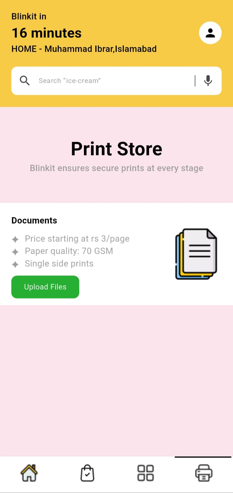
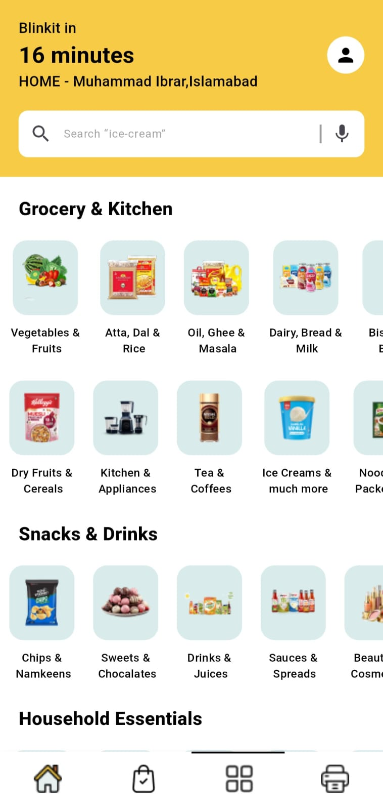
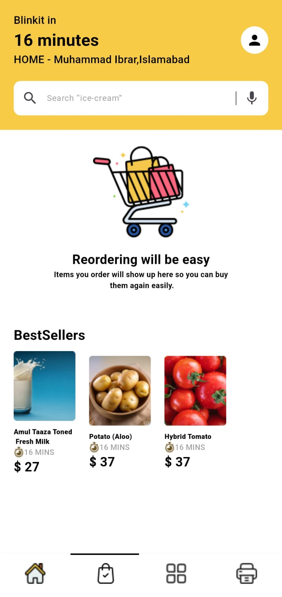
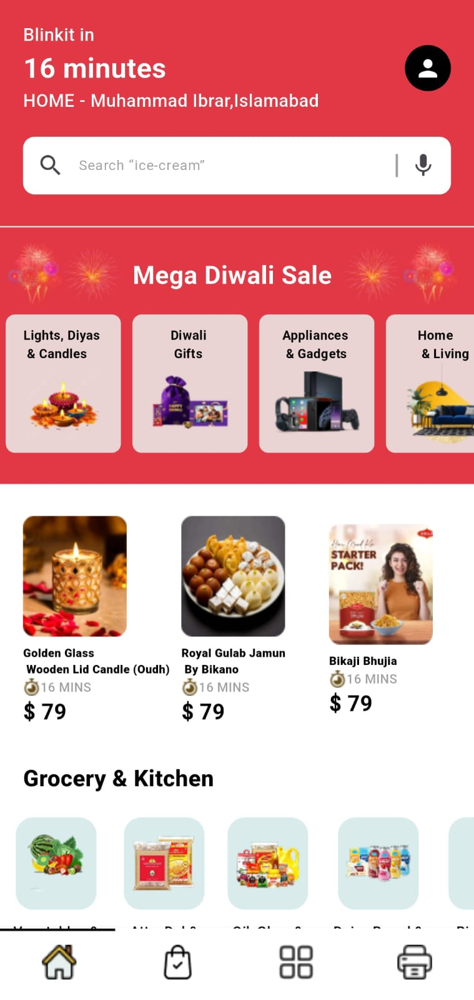
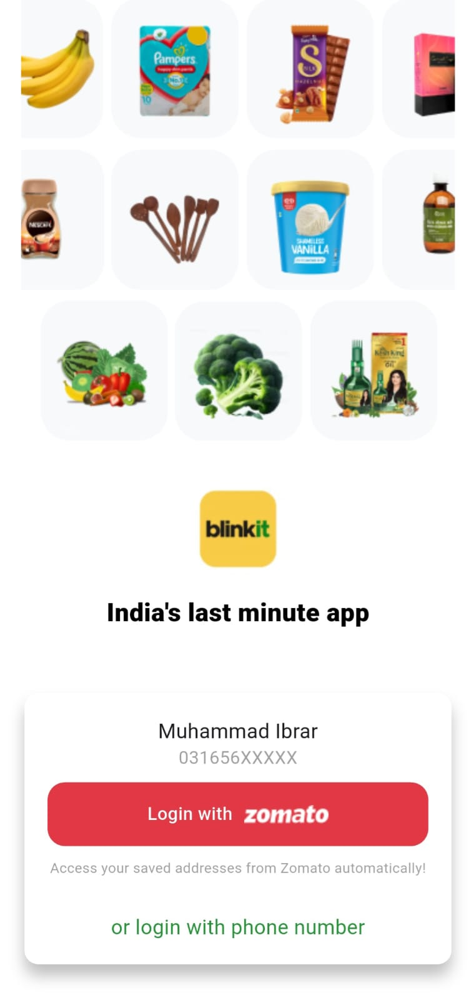
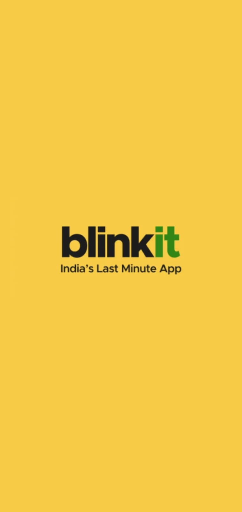

# 🛒 BlinkIt Clone – Flutter App

A high-performance grocery shopping app built with **Flutter**, inspired by BlinkIt. It uses **Clean Architecture** to ensure scalability, testability, and clean separation of concerns.

---

## 📱 Screenshots

### 🏠 Print Screen

### 🔍 Category Screen

### 🛍️ Cart Screen

### 🧺 Home Screen

### 🧺 Onboarding Screen

### 🧺 Splash Screen

---

## 🧠 Architecture

This project is structured using **Clean Architecture**, which separates the app into:

- **Presentation Layer:** UI + ViewModels (MVVM)
- **Domain Layer:** Use Cases & Entities
- **Data Layer:** Repositories, API Services, Models

🔹 **Benefits:**
- Scalable codebase
- Easy to test and maintain
- Clear separation of concerns

---

## 🚀 Features

- 🛒 Browse and search products
- 📦 Add to cart and checkout flow
- 📊 MVVM + Clean Architecture pattern
- 🎨 Clean and responsive UI

---

## 🧱 Folder Structure

